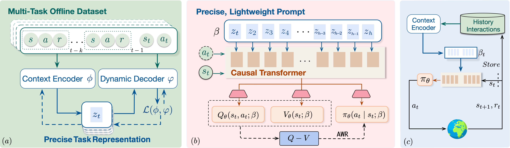

# Scalable In-Context Q-Learning

## **Overview**

Official codebase for SICQL: Scalable In-Context Q-Learning.



## **Instructions**

Implementation Details of SICQL.

### **Installation instructions**

```python
conda env create -f environment.yaml
```

## Download dataset

The datasets used in our experiments are located in the `datasets/` directory.  The collected dataset can be downloaded [here]( https://drive.google.com/file/d/1vyMUhbIFWa_6B2dEv42QR-9wKBoq6B7i/view?usp=share_link)

## Running

Running experiments based our code could be quite easy, you can execute the provided shell script to start:

```python
sh run.sh
```

Or if you wish to skip training, you can directly load our pretrained model using the provided script:

```python
python3 eval.py --env HalfCheetahVel-v0 --horizon 200 --context_horizon 4 --lr 3e-4 --n_layer 4 --m_layer 2 --head 1  --seed 1  --rollin_type 'mix' --epoch 400000  --freq 10000 --beta 1000.0 --n_embd 128  --context_hidden_dim 128 --context_dim 16  --c_layer 1  --context_epoch 200 --device 'cuda:0'
```

